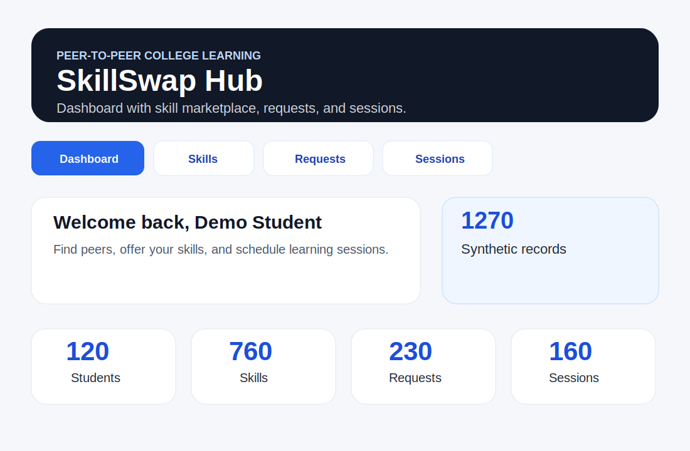

# SkillSwap Hub

## Author

Xinhao Chen

## Class Link

CS5610 Web Development：https://northeastern.instructure.com/courses/249954/assignments/3196237

## Deployed Website

Render :https://skillswaphub-ldip.onrender.com

## Demo Video


## Project Objective

SkillSwap Hub is a full-stack peer-to-peer skill exchange platform for college students. Students can create skill listings, browse skills from other students, send swap requests, and schedule learning sessions.

This project was built for Project 3 using the required architecture:

- Node + Express backend
- MongoDB with the native Node.js driver
- Client-side rendered React frontend with hooks
- Fetch API for AJAX requests
- Passport authentication

The project does not use Mongoose, Axios, CORS middleware, or any other prohibited library.

## Screenshot



Replace this mockup with a deployed application screenshot before final submission if your instructor requires an actual screenshot.

## Main Features

- User registration and login with Passport local authentication
- Profile update page
- Skill listing CRUD
- Skill browsing and filtering
- Swap request CRUD and status updates
- Learning session CRUD and status updates
- Dashboard with instructions and database record counts
- Seed script that creates more than 1,000 synthetic records

## MongoDB Collections

The application uses four collections:

- `users`
- `skills`
- `swapRequests`
- `sessions`

The `skills`, `swapRequests`, and `sessions` collections support full CRUD operations. Each feature includes React components, Express routes, MongoDB operations, and Fetch API requests.

## Demo Login

After running the seed script, use this account:

```text
username: demo
password: demo123
```

Other generated accounts use:

```text
username: student1, student2, student3, ...
password: student123
```

## Instructions to Build and Run Locally

### 1. Install dependencies

From the project root:

```bash
npm run install-all
```

Or install separately:

```bash
cd server
npm install
cd ../client
npm install
```

### 2. Configure environment variables

The backend reads environment variables from the runtime environment. Do not commit real secrets.

A sample file is provided here:

<!-- server/.env.example is referenced in the README but doesn't exist. -->

```bash
server/.env.example
```

For local development, the server can run with default values:

```text
MONGO_URI=mongodb://127.0.0.1:27017
MONGO_DB_NAME=skillswap_hub
PORT=3000
```

For deployment, set these variables in the hosting platform:

```text
MONGO_URI=your_mongodb_connection_string
MONGO_DB_NAME=skillswap_hub
SESSION_SECRET=your_session_secret
NODE_ENV=production
```

### 3. Seed the database

Make sure MongoDB is running, then run:

```bash
npm run seed
```

This creates approximately 1,270 synthetic records across users, skills, swap requests, and sessions.

### 4. Run the backend

```bash
npm run server
```

The backend runs on:

```text
http://localhost:3000
```

### 5. Run the React frontend

Open a second terminal:

```bash
npm run client
```

The frontend runs on:

```text
http://localhost:5173
```

The Vite development server proxies `/api` requests to the Express backend, so no CORS middleware is needed.

## Production Build

Build the frontend:

```bash
npm run build-client
```

Then start the backend:

```bash
npm start
```

The Express server serves the React build from `client/dist`.

## Linting and Formatting

Run ESLint for both backend and frontend:

```bash
npm run lint
```

Format all code with Prettier:

```bash
npm run format
```

## Deployment Notes

For Render or a similar public server:

- Root directory: project root
- Build command: `npm run install-all && npm run build-client`
- Start command: `npm start`
- Set environment variables in the hosting dashboard
- Do not commit `.env` or MongoDB credentials

## Design Document

The design document is available at:

```text
docs/design-document.md
```

It includes:

- Project description
- User personas
- Independent user stories
- Implementation responsibilities
- CRUD summary
- Design mockups

## AI Disclosure

AI was used for brainstorming, planning, and organizing the proposal/documentation. 

## License

MIT License
