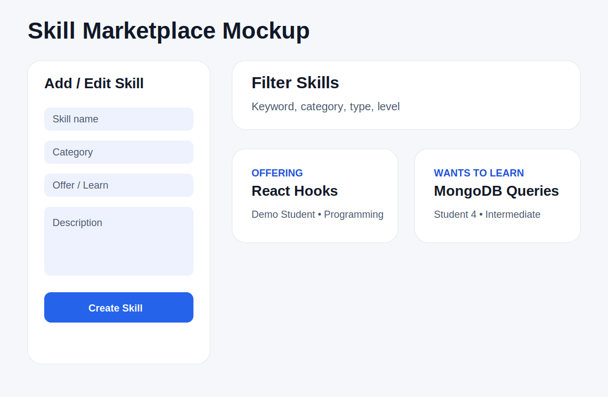

# SkillSwap Hub Design Document

## Project Description

SkillSwap Hub is a full-stack web application for college students who want to exchange academic, technical, career, and practical skills with peers. A student can list skills they can offer, list skills they want to learn, browse other students' skills, send skill swap requests, and schedule peer-to-peer learning sessions.

The project is not a generic study group finder. The main goal is peer skill exchange between individual students. For example, one student may offer React Hooks help and request MongoDB help, while another student may offer resume review and request help with JavaScript.

The application uses Node, Express, MongoDB with the native Node.js driver, Passport authentication, and a client-side rendered React frontend with hooks. The frontend communicates with the backend through Fetch API requests.

## MongoDB Collections

The application uses four MongoDB collections.

### users

Stores user account and profile data.

Main fields:

- username
- passwordHash
- displayName
- major
- year
- contactPreference
- role
- createdAt
- updatedAt

### skills

Stores skills that a user can offer or wants to learn.

Main fields:

- ownerId
- ownerName
- name
- category
- type
- level
- description
- availability
- locationPreference
- createdAt
- updatedAt

### swapRequests

Stores peer-to-peer skill exchange requests.

Main fields:

- requesterId
- requesterName
- receiverId
- receiverName
- requestedSkill
- offeredSkill
- message
- status
- createdAt
- updatedAt

### sessions

Stores scheduled learning sessions after students agree to meet.

Main fields:

- participantIds
- participants
- skillName
- meetingTime
- location
- notes
- status
- createdAt
- updatedAt

## User Personas

### 1. Skill Provider

A Skill Provider is a student who is confident in a specific skill such as React, JavaScript, Python, MongoDB, resume review, public speaking, or language practice. They want to help classmates while building connections and learning something in return.

### 2. Skill Learner

A Skill Learner is a student who needs help with a class topic, programming concept, career task, or practical skill. They want to find another student who can explain the topic in a peer-friendly way and schedule a short learning session.

### 3. Peer Mentor

A Peer Mentor is a student who regularly helps classmates and wants a more organized way to manage requests, availability, and sessions. They need a simple dashboard to list skills, check incoming requests, and track upcoming sessions.

## Independent User Stories

### User Story 1: Skill Profile Management

As a user, I want to create, view, update, and delete skills on my profile so that other students can understand what I can offer and what I want to learn.

Full-stack implementation includes:

- React SkillForm, SkillList, and SkillCard components
- Express routes for skill CRUD
- MongoDB operations on the skills collection
- Fetch API calls from the frontend

### User Story 2: Skill Browsing and Filtering

As a user, I want to browse and filter available skills by keyword, category, type, and level so that I can find a student who can help me with a specific topic.

Full-stack implementation includes:

- React filter form and skill list rendering
- Express GET route with query parameters
- MongoDB filtering using query objects
- Client-side state using React hooks

### User Story 3: Swap Request Management

As a user, I want to send, read, accept, reject, cancel, and delete skill swap requests so that I can manage peer learning requests.

Full-stack implementation includes:

- React RequestCenter and RequestCard components
- Express routes for request CRUD
- MongoDB operations on the swapRequests collection
- Status updates for pending, accepted, rejected, and cancelled requests

### User Story 4: Learning Session Management

As a user, I want to create, read, update, cancel, and delete scheduled learning sessions so that both students know when and where to meet.

Full-stack implementation includes:

- React SessionPlanner and SessionCard components
- Express routes for session CRUD
- MongoDB operations on the sessions collection
- Status updates for scheduled, completed, and cancelled sessions

## Implementation Responsibilities

The project can be completed by a two-person team without splitting work into frontend-only and backend-only tasks.

- Xinhao Chen: full stack for Skill Profile Management and Skill Browsing/Filtering.
- Teammate: full stack for Swap Request Management and Learning Session Management.

Each student implements frontend components, backend routes, MongoDB operations, and Fetch API integration for their own user stories.

If the instructor approves solo work, Xinhao Chen will implement the full stack for all four user stories.

## CRUD Summary

### Create

- Register a user account.
- Create a skill listing.
- Create a swap request.
- Create a learning session.

### Read

- View current user account information.
- Browse and filter skill listings.
- View incoming and outgoing swap requests.
- View scheduled learning sessions.

### Update

- Update user profile information.
- Edit skill listings.
- Accept, reject, or cancel swap requests.
- Mark sessions as completed or cancelled.

### Delete

- Delete skill listings.
- Delete swap requests.
- Delete learning sessions.

## Design Mockups

<!-- Requests, Sessions, Profile, and Auth panels have no corresponding mockup which can be included. -->

### Dashboard Mockup

The dashboard introduces the app, explains how to use it, and displays project statistics such as total students, skills, requests, sessions, and synthetic records.

### Skill Marketplace Mockup

The skill marketplace allows users to add skills, edit their own skills, delete their own skills, filter skills, and send swap requests to other students.

## Usability Notes

The app includes a dashboard section explaining how to use the system. Authenticated users can manage skills, requests, sessions, and profile details. Demo credentials are provided in the README so a grader can quickly test the app.

## AI Disclosure

AI was used for brainstorming, project organization, and drafting documentation. The final application code should be reviewed, understood, and explained by the student team before submission.
